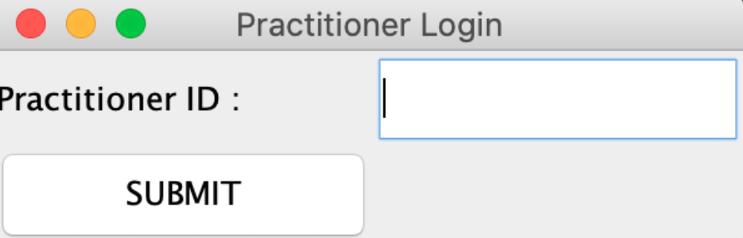
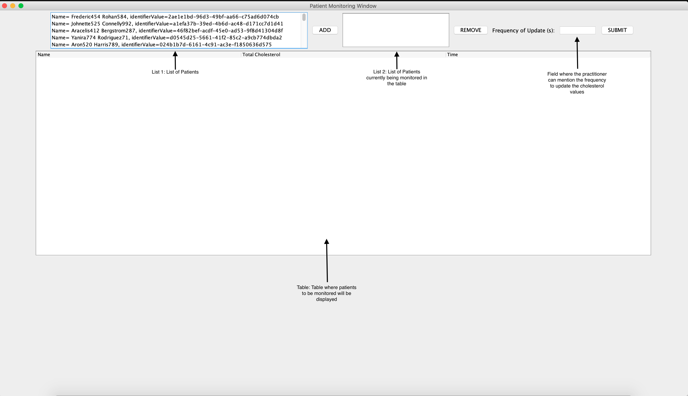
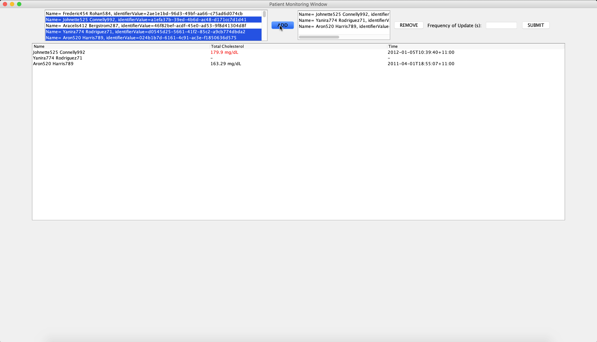
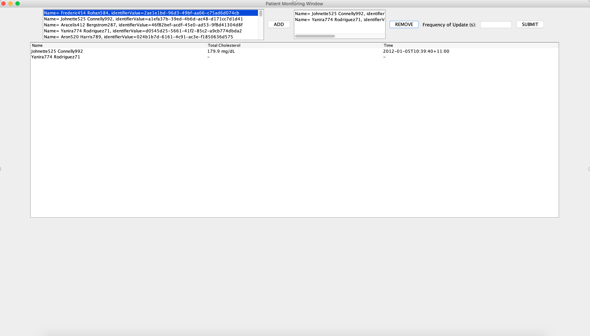
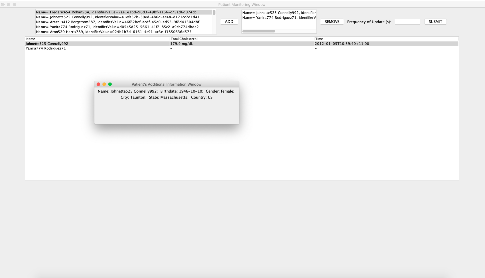
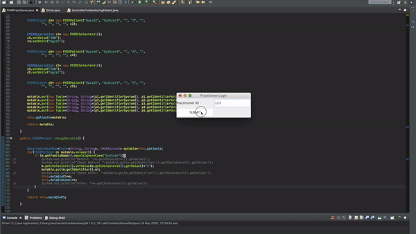

## **LegoBuilders FHIR Patient Monitoring System**

#### **UserGuide**

1. Execute the driver and you will be prompted with Practitioner Login window:

2. Enter a valid Practitioner ID and click on Submit. The Application will accept the practitioner ID, and then extract the Practitioner's identifier, and perform searches thereafter using only identifiers for patients and practitioners. 

(Note - The application will take some time to retrieve and load the list of patients depending on the size of the list of patients.)

3. The practitioner’s list of patients will be displayed in a new window. (If this code is run on a mac book, please maximise the window for the best layout of GUI components).

4. The user can multiple select patients from List 1 as shown in the figure and click the ADD button. Upon selecting the patients and clicking the ADD button, you will see a GUI similar to the figure shown below:

As you can see the list 2 currently shows the patients that are currently being monitored. The Table is populated with the relevant information and the cholesterol above the average cholesterol is highlighted in red. 

5.	Now to remove patients, select a patient from List 2, and click on remove. Upon clicking remove button, List 2 will be updated and the table and the average cholesterol will be updated as well. Performing these steps on the patient Aron520 from the previous image will produce this result as shown in the figure below. Clicking the remove button without selecting a patient from the right list should remove all the patients in the list.

6. Finally, single clicking a patient row in the table will provide the user with additional information in a separate window as shown below

#### **Test for GUI update for specified N seconds with mock Patient Data**
The code is tested by adding a 1 to the cholesterol value of patient 1 whenever a get request is made. So after every N seconds, the GUI should show the updated value of another "1" added to the previous cholesterol value.  
At first, N is set to 2, and the cholesterol is updated every 2 seconds.  
and similarly when N is set to 5, the cholesterol is updated every 5 seconds. 
Using this we now, know that the observer pattern works in this Patient Monitoring System. 
Also, if you want to stop getting the updated values, enter 0 seconds in the frequency text field!  
